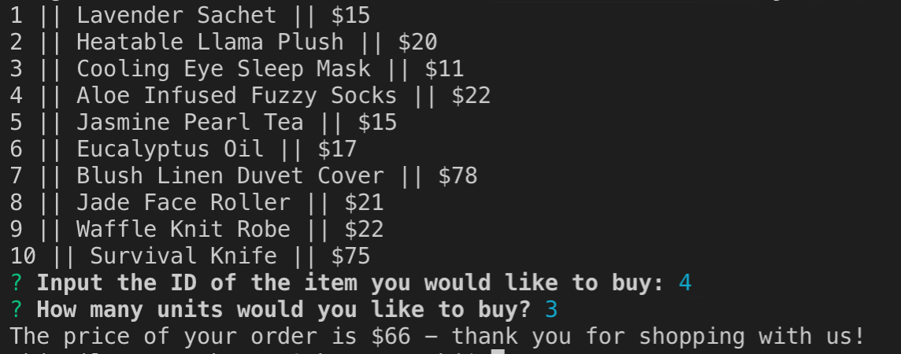

# Bamazon Node App

## System Requirements
- GitBash or Terminal
- NodeJS
- MySQL
- MySQL Workbecnh, Sequel Pro or comparable MySQL database interface
- npm

## Instructions
1. Input `git clone` + the repo's clone URL to clone the repository into your computer
2. Use your terminal to navigate to the directory of the cloned repository and run `npm install` - the package.json will assure that all required modules are installed
3. Open your preferred MySQL database manager and past in or import the code from `bamazon-products.sql`
4. Run the query fromt he provided code to initialize the database, create the table and populate the table
5. Open your terminal and if you are not still in your git directory, navigate to the repo directory. Run `node bamazonCustomer.js`
6. Follow the instructions on the prompt